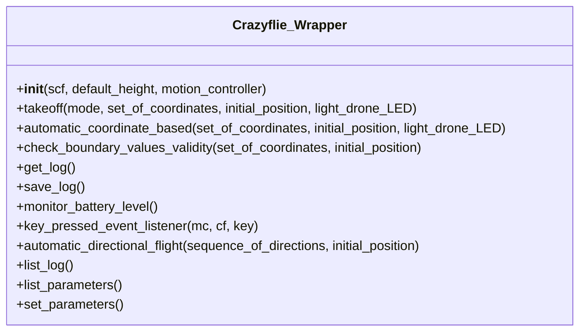

# Crazyflie Wrapper Framework Documentation

This repository provides a Python wrapper around the Bitcraze Crazyflie ecosystem for automated indoor flight experiments and mission execution.

Its main functionality is:

- connecting to a Crazyflie through Crazyradio,
- executing automated flight missions from either manual waypoints or sketched paths,
- monitoring flight state through logged telemetry,
- implementing safety controls through keyboard input during operation,
- saving flight data for later inspection and analysis.

The two main ways of flying the drone are described in [Drone Flight Modes and Implementation](#drone-flight-modes-and-implementation). The wrapper logic behind those modes is summarized later in [Wrapper Structure and Function Relations](#wrapper-structure-and-function-relations).

## Contents

- [Repository Overview](#repository-overview)
- [Architecture and Runtime Flow](#architecture-and-runtime-flow)
- [Bitcraze Ecosystem Terminology](#bitcraze-ecosystem-terminology)
- [Main Entry Points](#main-entry-points)
- [Drone Flight Modes and Implementation](#drone-flight-modes-and-implementation)
- [Wrapper Structure and Function Relations](#wrapper-structure-and-function-relations)
- [Keyboard Safety Controls](#keyboard-safety-controls)
- [Installation](#installation)
- [Pre-Flight Checklist](#pre-flight-checklist)
- [Coordinate and Boundary Assumptions](#coordinate-and-boundary-assumptions)
- [Logging and Analysis](#logging-and-analysis)
- [Onboarding Workflow](#onboarding-workflow)
- [Practical Notes](#practical-notes)

## Repository Overview

The repository is built around a high-level wrapper class that sits on top of Bitcraze's Python communication stack. It is designed to support flight automation in a Lighthouse-based indoor positioning environment.

At a high level, the repository supports:

- radio-based connection to the drone,
- automated mission execution,
- live telemetry observation before and during flight,
- controlled authorization before takeoff,
- graceful landing and emergency stop behavior,
- mission generation from sketches,
- telemetry logging and post-flight analysis.

## Architecture and Runtime Flow

The overall control flow is shown below.

<div align ="center">

</div>

Operationally, the runtime sequence is:

1. initialize `cflib` drivers,
2. connect to the Crazyflie through Crazyradio,
3. create the wrapper object,
4. validate or generate waypoint coordinates,
5. print live telemetry and wait for stable readings,
6. authorize flight,
7. execute takeoff and waypoint traversal,
8. land and save the resulting logs.

This flow applies to both supported flight modes. The difference lies in how the waypoint list is produced before execution.

## Bitcraze Ecosystem Terminology

- `Bitcraze` refers to the ecosystem around the Crazyflie platform; `Crazyflie` is the quadcopter itself; `Crazyradio` is the USB radio dongle used for communication; `cflib` is Bitcraze's Python library used by this repository; `cfclient` is Bitcraze's desktop client used to verify connectivity, stability, and tracking; `Lighthouse positioning` refers to the indoor positioning method assumed by the waypoint-based flight logic in this repository.

## Main Entry Points

The most important files for repository onboarding are:

- [automated_waypoints_flight_demo.py](c:/Users/ku5001144/Downloads/Bitcraze-Crazyflie-Wrapper-Framework-main/Bitcraze-Crazyflie-Wrapper-Framework-main/automated_waypoints_flight_demo.py)
  Manual coordinate-based mission demo.

- [demos/sketch_demo/sketch_flight_demo.py](c:/Users/ku5001144/Downloads/Bitcraze-Crazyflie-Wrapper-Framework-main/Bitcraze-Crazyflie-Wrapper-Framework-main/demos/sketch_demo/sketch_flight_demo.py)
  Sketch-based mission demo.

- [src/control/crazyflie_wrapper.py](c:/Users/ku5001144/Downloads/Bitcraze-Crazyflie-Wrapper-Framework-main/Bitcraze-Crazyflie-Wrapper-Framework-main/src/control/crazyflie_wrapper.py)
  Core wrapper class used by both flight modes.

- [src/translate_sketch_to_IPS.py](c:/Users/ku5001144/Downloads/Bitcraze-Crazyflie-Wrapper-Framework-main/Bitcraze-Crazyflie-Wrapper-Framework-main/src/translate_sketch_to_IPS.py)
  Sketch-to-waypoint conversion logic.

## Drone Flight Modes and Implementation

This section describes the two supported ways of flying the drone in this repository.

### A. Manual coordinate mission

This workflow is implemented in [automated_waypoints_flight_demo.py](c:/Users/ku5001144/Downloads/Bitcraze-Crazyflie-Wrapper-Framework-main/Bitcraze-Crazyflie-Wrapper-Framework-main/automated_waypoints_flight_demo.py).

To start the manual-coordinate workflow, run:

```bash
python automated_waypoints_flight_demo.py
```

This mode defines:

- the Crazyflie URI,
- a `starting_position`,
- a list of mission coordinates.

Each waypoint follows this format:

```python
(x, y, z, velocity)
```

Example:

```python
starting_position = (1.5, 2.5, 1.0)

mission_coordinates = [
    (1.5, 3.0, 1.0, 0.1),
    (2.0, 3.0, 1.0, 0.1),
    (2.5, 3.0, 1.0, 0.1),
]
```

This mission is already expressed directly in the lab or IPS coordinate frame, so no translation step is required before execution.

### B. Sketch-based mission

This workflow is implemented through:

- [demos/sketch_demo/sketch_pattern_gui.py](c:/Users/ku5001144/Downloads/Bitcraze-Crazyflie-Wrapper-Framework-main/Bitcraze-Crazyflie-Wrapper-Framework-main/demos/sketch_demo/sketch_pattern_gui.py)
- [src/translate_sketch_to_IPS.py](c:/Users/ku5001144/Downloads/Bitcraze-Crazyflie-Wrapper-Framework-main/Bitcraze-Crazyflie-Wrapper-Framework-main/src/translate_sketch_to_IPS.py)
- [demos/sketch_demo/sketch_flight_demo.py](c:/Users/ku5001144/Downloads/Bitcraze-Crazyflie-Wrapper-Framework-main/Bitcraze-Crazyflie-Wrapper-Framework-main/demos/sketch_demo/sketch_flight_demo.py)

To start the sketch-based workflow, run:

```bash
python demos/sketch_demo/sketch_flight_demo.py
```

This mode converts a 2D sketch into flyable 3D waypoint tuples and then passes them to the same wrapper execution path used by manual coordinate missions.

The implementation flow is:

1. capture pixel coordinates from the sketch,
2. normalize the recorded sketch points,
3. select a `motion_plane`, if not specified "x-z" is used,
4. map the normalized points into lab coordinate limits,
5. inject the constant axis determined by the selected motion plane,
6. append velocity to each generated waypoint,
7. sample the waypoint list to reduce mission size,
8. execute the resulting waypoint sequence through the wrapper.

#### Motion plane and axis of flight

This is the key configuration concept in sketch-based missions.

A sketch is only 2D, while the drone flight path is 3D. The code resolves this by selecting a motion plane in [src/translate_sketch_to_IPS.py](c:/Users/ku5001144/Downloads/Bitcraze-Crazyflie-Wrapper-Framework-main/Bitcraze-Crazyflie-Wrapper-Framework-main/src/translate_sketch_to_IPS.py).

Supported motion planes:

- `x_z`: the sketch controls `x` and `z`, while `y` remains fixed,
- `y_z`: the sketch controls `y` and `z`, while `x` remains fixed.
- `x_y`: the sketch controls `x` and `y`, while `z` remains fixed. 

This means the intended axis of flight must be specified during sketch-based mission generation. If no different motion plane is selected, the default plane is used by the implementation.

## Wrapper Structure and Function Relations

The core implementation is centered on [src/control/crazyflie_wrapper.py](c:/Users/ku5001144/Downloads/Bitcraze-Crazyflie-Wrapper-Framework-main/Bitcraze-Crazyflie-Wrapper-Framework-main/src/control/crazyflie_wrapper.py).

The diagram below summarizes the main wrapper functions and how they relate to each other.



Function roles:

- `__init__(scf, default_height, motion_controller)`
  Initializes the connection state, configures the commander, resets estimator parameters, and starts background monitoring and logging threads.

- `automatic_coordinate_based(set_of_coordinates, initial_position, light_drone_LED=False)`
  Main high-level execution entry point for both supported flight modes after waypoint coordinates exist.

- `check_boundary_values_validity(set_of_coordinates, initial_position)`
  Validates that the initial position and all mission coordinates stay inside the configured lab boundaries.

- `takeoff(mode, set_of_coordinates, initial_position, light_drone_LED=False)`
  Handles the main operational flow: keyboard listener startup, telemetry observation, flight authorization, arming, takeoff, waypoint traversal, and landing.

- `get_log()`
  Retrieves the main runtime telemetry used for observation and battery-state updates.

- `save_log()`
  Continuously writes telemetry to `log_output.csv`.

- `monitor_battery_level()`
  Tracks battery level during operation and can trigger graceful landing when required.

- `key_pressed_event_listener(mc, cf, key)`
  Handles authorization, graceful landing, emergency stop, and related keyboard-triggered actions.

The functional dependency is straightforward:

- both flight modes produce waypoint tuples,
- those waypoint tuples are passed to `automatic_coordinate_based(...)`,
- that method validates the mission and then calls `takeoff(...)`,
- `takeoff(...)` uses logging, safety controls, and commander actions to execute the mission.

## Keyboard Safety Controls

The wrapper uses keyboard controls for operational safety.

- `Home`: authorize automated flight
- `Down Arrow`: graceful landing
- `Esc`: immediate emergency stop
- `End`: reserved interrupt/challenge pathway

The most important operational note is that the wrapper intentionally waits for `Home` before proceeding with the mission.

If `self.proceed_automated_flight` is set to `True`, the `Home` authorization step can be bypassed according to operational need, though this is generally not recommended for normal operation.

## Installation

Two installation routes are already represented in the repository.

### Option 1: Editable install

```bash
pip install -e .
```

### Option 2: Conda environment

```bash
conda env create -f crazyflie_conda_environment.yml
conda activate secondary_env_py_3.11
```

The conda environment is the clearer option because it includes the broader set of packages used by the demos and utilities.

## Pre-Flight Checklist

Before attempting a mission:

1. connect the Crazyradio,
2. power the Crazyflie,
3. open `cfclient`,
4. verify the URI,
5. verify estimator stability,
6. verify Lighthouse tracking,
7. place the drone in a tracked area,
8. confirm that the mission lies inside the lab bounds,
9. run the relevant Python demo,
10. wait for the log readings to remain stable before authorizing flight.

Unstable telemetry before takeoff is a strong indicator that the mission should not be authorized yet.

## Coordinate and Boundary Assumptions

The wrapper currently validates waypoint coordinates against hard-coded lab limits:

- `x <= 6.8`
- `y <= 5.3`
- `z <= 2.7`

These values are environment-specific. If the tracked space differs, update the limits before trusting automated missions.

The mission coordinates are absolute coordinates in the lab frame, not relative direction commands.

## Logging and Analysis

The wrapper saves a live CSV log to:

```text
log_output.csv
```

It records key variables such as:

- estimated position,
- battery level,
- flight state,
- Lighthouse status.

Additional support material is available in:

- [src/logging/README.md](c:/Users/ku5001144/Downloads/Bitcraze-Crazyflie-Wrapper-Framework-main/Bitcraze-Crazyflie-Wrapper-Framework-main/src/logging/README.md)
- [src/localization/README.md](c:/Users/ku5001144/Downloads/Bitcraze-Crazyflie-Wrapper-Framework-main/Bitcraze-Crazyflie-Wrapper-Framework-main/src/localization/README.md)

## Onboarding Workflow

For a reliable onboarding path:

1. read this file,
2. inspect the relevant entry script in [Main Entry Points](#main-entry-points),
3. verify the drone in `cfclient`,
4. begin with a small manual coordinate mission,
5. inspect the resulting logs,
6. move to the sketch workflow when the baseline manual mission is stable.

## Practical Notes

- Manual coordinate missions are the best first test because they avoid ambiguity in waypoint generation.
- Sketch-based missions require explicit thought about the flight plane.
- If no alternative plane is selected in the sketch translation logic, the default plane is used.
- Both manual and sketch-generated missions ultimately become the same waypoint structure before flight execution.
- Stable telemetry before takeoff is one of the strongest predictors of a safe and successful run.
